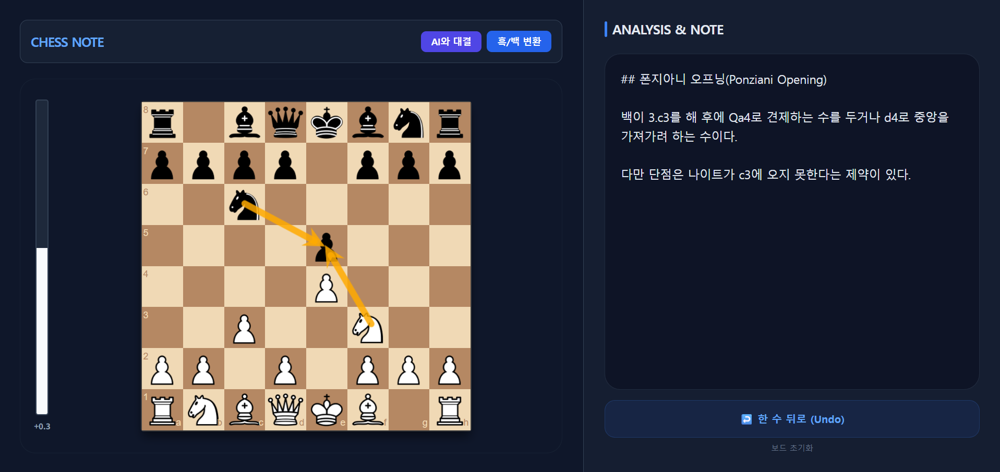

This is a personal chess study notebook that provides real-time auto-saving.

## Getting Started
1. Download the project to your computer.
    + Option 1: Go to Releases and download the Source code (zip) of the latest version.
    + Option 2: Clone this repository.
2. After extracting the ZIP file, double-click and run the 'run.bat' file in the folder.
3. The server will run automatically, and the chessboard will appear in your browser.

## Intelligent AI Features
+ AI Battle Mode: Practice against the Stockfish 17.1 engine.
+ Real-time Eval Bar: Visually analyzes the current position.
+ Engine Selection: Choose from various AI engines to match your skill level (Coming Soon).

## Study & Record
+ Auto-Save: Data is safely saved to the server (storage.json) 1 second after typing a note.
+ Smart Undo: Revert to the previous move by pressing the left arrow key (←) or the button.
+ Graphic Annotations: Draw arrows by right-click dragging or highlight squares with a right-click. (※ These are not saved.)

---

실시간 자동 저장 기능을 제공하는 개인용 체스 연구 노트입니다.

## 시작하기
1. 이 저장소를 내 컴퓨터로 가져옵니다.
    + 방법 1: `Releases`에서 최신 버전을 클릭해 소스 코드를 다운로드합니다.
    + 방법 2: 이 저장소를 복제(Clone)합니다.
2. 압축을 푼 뒤, 폴더 내의 'run.bat' 파일을 더블 클릭하여 실행합니다.
3. 자동으로 서버가 실행되고 브라우저에 체스보드가 나타납니다.

## 지능형 AI 기능
+ AI 배틀 모드: Stockfish 17.1 엔진을 상대로 실전 연습이 가능합니다.
+ 실시간 승률 바 (Eval Bar): 현재 형세를 시각적으로 분석해 줍니다.
+ 엔진 선택: 사용자의 수준에 맞춰 다양한 AI 엔진을 선택할 수 있습니다.(추가 예정)

## 연구 및 기록
+ 자동 저장: 메모 작성 후 1초 뒤 서버(storage.json)에 데이터가 안전하게 저장됩니다.
+ 스마트 Undo: 키보드 왼쪽 화살표(←) 또는 버튼을 눌러 한 수 전으로 되돌릴 수 있습니다.
+ 그래픽 주석: 우클릭 드래그로 화살표를 그 시각적으로 강조할 수 있습니다. (※ 저장되지는 않습니다.)